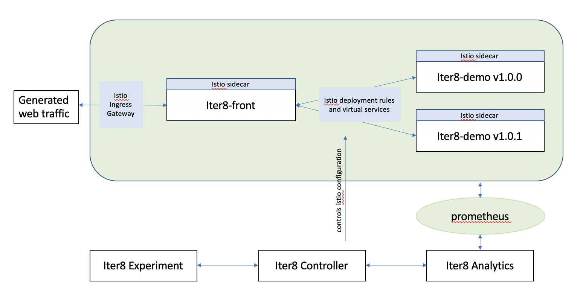
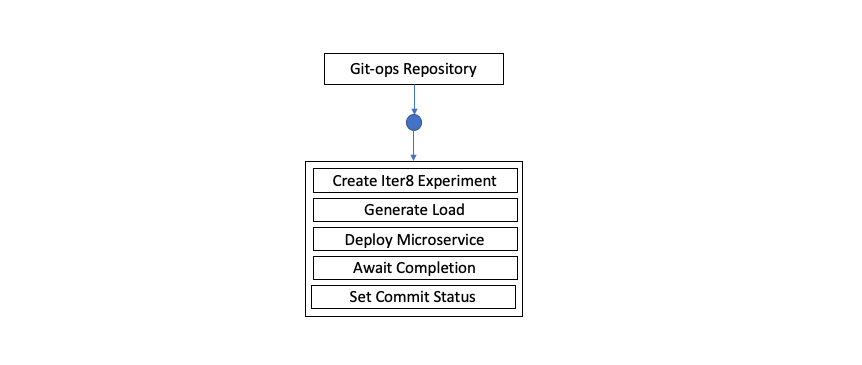
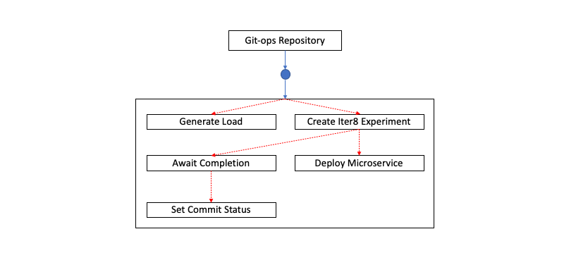
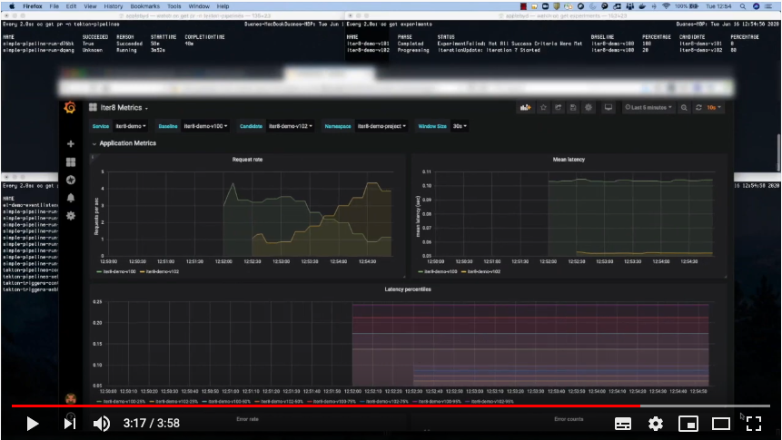
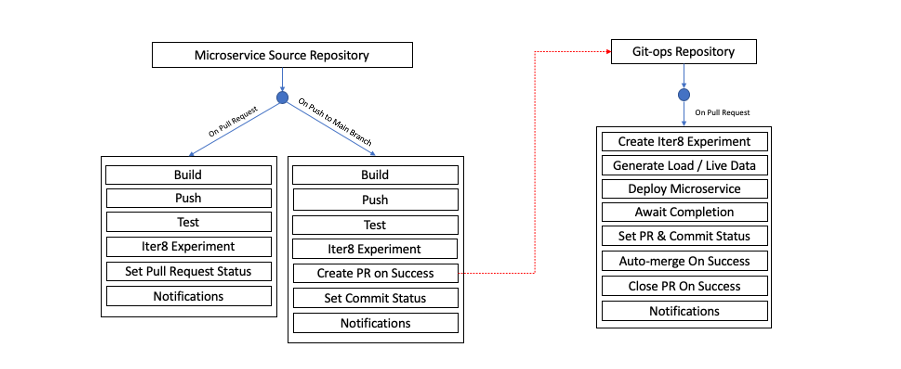

# Performing Automated Canary Releases Using Iter8 In Tekton

This article looks at using Iter8 in a Tekton pipeline to perform automated canary releases of a microservice. With canary releases, a new version of your microservice is deployed to sit alongside your existing version and traffic is routed to your new version as specified in a set of rules. You then monitor how your new version performs and make decisions about increasing the traffic to your new deployment until such a time that all traffic is directed to the new release.

Iter8 v0.1.1 automates cloud-native canary releases, which are driven by analytics based on robust statistical techniques. It comprises two components, the `iter8-analytics` component and the `iter8-controller` component. The analytics component assesses the behavior of different versions of a microservice by analyzing metrics to determine whether the newer version performs to the specified success criteria. The Iter8 controller adjusts traffic between the different versions of the microservice based on recommendations from the analytics components' REST API. Fundamentally, traffic decisions are made by the analytics component and honored by the controller.

The test and its success criteria are defined in an experiment: a [Kubernetes custom resource (CRD)](https://kubernetes.io/docs/concepts/extend-kubernetes/api-extension/custom-resources/) defined by Iter8. In the experiment, we define properties such as:

* The baseline and candidate deployments.
* The metric to be analyzed, such as `iter8_latency`, which is the latency of the service.
* The number of iterations of the experiment to run and what routing rules to apply. For example, increase traffic to the new service by 20% after each successful iteration.  


## Example of using Iter8 in Tekton

In the [tutorial](https://github.com/IBM/iter8-in-tekton-canary-release) associated with this article, there is a simple web application that is made up of a front-end service that performs a call to a back-end service and displays the result to the user.


By making a change to the deployment YAML file stored in a Git repository, a webhook triggers a Tekton pipeline that creates and runs the Iter8 experiment. The pipeline generates web traffic to the application, faking user requests (as this is not a live application with actual users) for Iter8 to analyze. Iter8 then makes use of Istio to control the split of traffic between the older and newer deployments, depending upon the analytical information from Prometheus.



The pipeline that is used in the tutorial runs through five tasks:

1. Creating the Iter8 experiment.
1. Generating load to the application.
1. Applying the new deployment causing the experiment to start.
1. Waiting for experiment completion.
1. Updating the `git commit` status based on the result.



While the pipeline is made up of five tasks, they do not all run sequentially and the topology is actually more akin to the flow outlined in the following diagram. [Read more about the Tekton resources used in the tutorial.](https://github.com/IBM/iter8-in-tekton-canary-release)



The result of the experiment dictates which deployment of the microservice is left running. The pipeline task that checks for the experiment's completion removes the unused microservice deployment. You can find more information about the experiment CRD in the [Iter8 documentation](https://github.com/iter8-tools/docs), but ensure you look at the relevant version of the documentation for your Iter8 installation.

The experiment, as defined in the tutorial's pipeline task, is:

```
      apiVersion: iter8.tools/v1alpha1
      kind: Experiment 
      metadata:
        name: ${EXPERIMENT_NAME}
      spec:
        targetService:
          name: $(inputs.params.service-name)
          apiVersion: v1 
          baseline: ${BASELINE_DEPLOYMENT_NAME}
          candidate: ${CANDIDATE_DEPLOYMENT_NAME}
        trafficControl:
          strategy: check_and_increment
          interval: 30s
          trafficStepSize: 20
          maxIterations: 8 #default value = 100
          maxTrafficPercentage: 80 #default value = 50
          onSuccess: ${ON_SUCCESS}
        analysis:
          analyticsService: "http://iter8-analytics.iter8:8080"
          successCriteria:
            - metricName: iter8_latency
              toleranceType: threshold
              tolerance: 0.2
              sampleSize: 6
```

In the tutorial code changes are made twice, once testing a deployment of the microservice that does not not meet the success criteria and then again with a version that does.  The following video shows the two runs in action. Note: return to this page using your browser's back button after viewing.

[](http://www.youtube.com/watch?v=LLfUapMbNWw "Performing automated canary releases using Iter8 in Tekton tutorial")


## Broader usage of Iter8 in DevOps/GitOps


The tutorial gives you a flavor for how you can add Iter8 into Tekton pipelines. With an understanding of this simple scenario, you should be able to extrapolate how you can use Iter8 in broader DevOps and GitOps scenarios.

The point at which you might want to use technology like Iter8 is highly debated and beyond the scope of this article. Some people argue that you would not use such release strategies in production, while others advocate it. Some people would not use it in development environments, while others would. Only you can decide what is the best fit for your organization and it depends on what you are trying to achieve.

As more support for different release strategies is added, it may be that you want to use Iter8 in a number of places to achieve different goals. You might use Iter8 for performance testing throughout the development, staging, and production phases of the software delivery lifecycle, but only perform A/B testing for user feature preference in your production environment. An extreme version of the performance testing use case might see usage in a scenario similar to the one represented in the following diagram.



In this scenario, Iter8 is integrated into three pipelines across two repositories. When developers submit a pull request (PR) to the microservice, Iter8 is used as one of the verification tests. This would likely be in an isolated namespace so the base deployment of the main branch would need installation as well as the newly built service. The results of the experiment here could be fed back and marked onto the PR, which gives the developer the earliest possible opportunity to realize they introduced a performance problem. However, note that this may not be feasible since your microservice may not be able to be tested in isolation from the broader application. It also may not be feasible to install the entire application into the test namespace. Equally, it's possible that the testing you do at this stage is specific to this microservice, while later in the lifecycle you can canary test the application performance as a whole.

After an approver merges the PR into the main branch, another pipeline is triggered that runs an Iter8 experiment on the code as it now appears in the main branch. You could even use tools within your pipeline to create a PR into your GitOps repo, which upgrades the image tag for the specific service upon successful completion of all tests.

The GitOps repo itself could trigger a third pipeline that tests the new build in the live environment. If successful, Iter8 can leave the new deployment in place and remove the old one. Again, tools could be used to `automerge` the PR into the main branch from within the pipeline and also close out the PR. Notifications can even be sent to a Slack channel or emailed to advise of problems or successes.

In v0.2 of Iter8, you can now compare a baseline and candidate service rather than deployments. Also, from v1.0.0 of Iter8, you are able to perform A/B deployments, but these are beyond the scope of this article.

## Summary

Iter8 and Tekton can be combined together to create powerful cloud-native release automation based on runtime performance analytics. This looks likely to become more powerful with newer releases.

Getting up and running with Iter8 is relatively simple and the [tutorials in the Iter8 GitHub repository](https://github.com/iter8-tools/docs#tutorials) provide a good grounding in how to use the technology. There is plenty of active development both on the code base and the associated documentation, and additional media resources, such as blogs and videos, are coming soon.

Tekton itself is proving to be ever more powerful and popular, with the associated Kubernetes CRDs recently moving from an alpha to beta API group, which guarantees more stability between releases.  

A growing community supplies the Tekton catalog repository with off-the-shelf tasks that can be integrated into your own pipelines. The [tutorial associated with this article](https://github.com/IBM/iter8-in-tekton-canary-release) makes use of one of these community tasks to perform the GitHub status updates. The continued growth of the catalog repository and other supporting software might be key to ensuring users can easily switch from other technologies where a set of available plug-ins and extensions is already available and in use.

As a next step, I encourage you to run through the [tutorial](https://github.com/IBM/iter8-in-tekton-canary-release) to see Iter8 in action as part of a Tekton pipeline.

